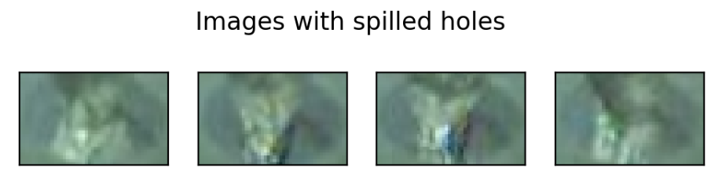

# ДЗ 1. Байесовская генерация и автоэнкодеры

## 1. Байесовский генератор стилей

Реализуйте генератор случайных аватаров, используя байесовский подход. Генератор должен создавать новые аватары на основе статистики существующих изображений.

Требования к реализации:
1. Испльзуя данные о популярных стилях из файла styles.py написать генератор (можно в виде функции, можно ввите класа [generator](https://wiki.python.org/moin/Generators)):
   - использует данные о стилях
   - на основе формулы MLE и формулы Байеса о полной вероятности генерировать случайный стиль
   - так же вернуть вероятность генерации данного стиля
2. Создайте генератор (как функцию или [класс-генератор](https://wiki.python.org/moin/Generators)), который:
   - Анализирует существующие аватары из папки avatars
   - Для каждого пикселя и каждого цветового канала (R,G,B) вычисляет распределение вероятностей значений на основе:
     * Метода максимального правдоподобия (MLE)
     * Формулы полной вероятности Байеса
   - Генерирует новые аватары, случайно выбирая значения пикселей согласно полученным распределениям

3. Генератор должен также возвращать вероятность генерации полученного стиля аватара

4. Выложите в репозиторий:
   - Код генератора (2шт, на остнове категорий и пикселей)
   - 5 примеров сгенерированных стилей\аватаров 
   - Для каждого стиля\аватара укажите вероятность его генерации

## 2. Автоэнкодер: определение аномалий

Имеются изображения технологического процесса разлива металлических цилиндров. Есть риск нарушения технологии: когда стенки цилиндра не успевают застывать и трескаются, незастывший металл выливается, не образуя требуемую заготовку. Необходимо оперативно определить лунку, где произошел пролив, при этом пролив - довольно редкое явление, гораздо больше изображений без пролива в лунке.

Задача: построить модель на основе автоэнкодера, определяющую состояние лунки:
- пролив
- не пролив.

### Датасет
Данные - вырезанные с фото изображения лунок. 
[Ссылка на датасет](https://drive.google.com/file/d/1DHuQ3DBsgab6NtZIZfAKUHS2rW3-vmtb/view)




```
dataset
├── proliv  # изображения с проливами
|       ├── 000.jpg
│       ├── 001.jpg
│       │   └── ...
|
├── test  # тестовая выборка где перемешаны проливы и не_проливы
│       ├── imgs
│       │   ├── 000.jpg
│       │   ├── 001.jpg
│       │   └── ...
│       └── test_annotation.txt
|
├── train  #  обучающая выборка из не_проливов
|       ├── 000.jpg
│       ├── 001.jpg
│       └── ...
```

### План решения

1. Имплементировать или найти автоэкодер.
2. Обучить автоэнкодер на не проливах (dataset\train).

    Если через такой автоэнкодер прогнать изображение пролива, то MSE между входным изображением и выходным будет больше, чем если прогнать изображение без пролива. Следовательно, если определить некоторое пороговое значение MSE, можно классифицировать изображение на классы пролив\не_пролив. (MSE между входной картинкой и выходной больше фиксированного порога - пролив).
    В качестве loss функции используем MSE (как минимум для baseline).

3. Написать метод классификации лунок в зависимости от порога. Для определения порога используем изображения из dataset\proliv.
4. На изображениях из dataset\test протестировать качество: посчитать True_positive_rate и True_negative_rate (нужно получить более 95% по каждой).

#### Для выполнения ДЗ можно также выбрать один из датасетов:
1. https://www.kaggle.com/datasets/wardaddy24/marble-surface-anomaly-detection-2
2. https://www.kaggle.com/datasets/ipythonx/mvtec-ad
3. https://www.kaggle.com/datasets/trainingdatapro/brain-anomaly-detection
4. https://www.kaggle.com/datasets/belkhirnacim/textiledefectdetection


### ВНИМАНИЕ!!!
Для прошедших курс Обработка и генерация изображений для решения использовать архитектуру [MNAD](https://github.com/cvlab-yonsei/MNAD)

1. Обучить
2. Визуализировать кластеры скрытого пространства
